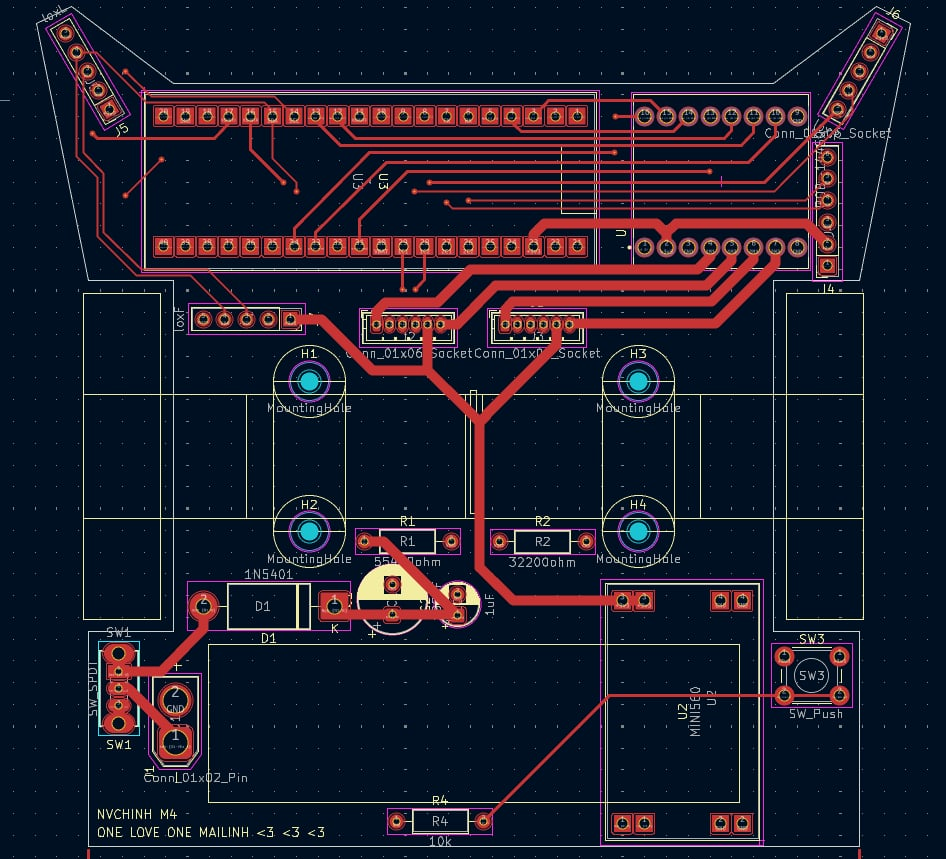
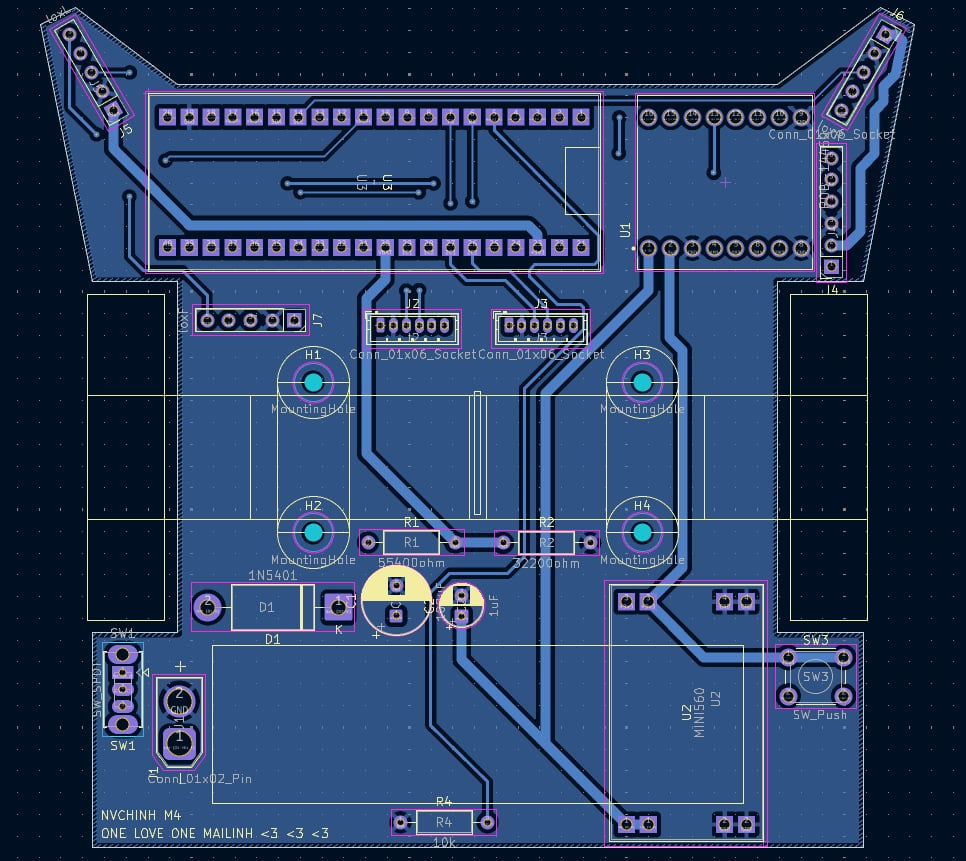

# NVCHINH-MICROMOUSE Project

## Project Overview

Complete source code for an autonomous Micromouse robot. The primary objective of this project is to design and build a small, autonomous robot capable of navigating and solving a standardized 16x16 maze in the shortest possible time.

The project integrates embedded software development using PlatformIO, focusing on efficient pathfinding algorithms, precise motor control (PID), and accurate sensor data processing.
##  Achievements & Awards

* **[6TH FINAL UET MAKERTHON 2025]** 
    * *Achieved the fastest maze completion time in semi-final of 9.8 seconds]*

## Repository Structure

* `src/`: Main source code files (C/C++) for the microcontroller.
* `lib/`: Project-specific libraries and drivers.
* `platformio.ini`: Configuration file for PlatformIO build environment.

## Hardware Specifications

* **MCU:** BLACKPILL STM32F411CEU6 100Mhz, 128KB RAM, 512KB ROM
* **Sensors:** x3 VL53L0X, 6DOF IMU MPU6050
*  **Communication:** HC-05 Bluetooth Module
* **Motor Driver:** TB6612FNG
* **Motors:** DC Servo GA12 N20 DC Geared Motor 1:10 1500RPM
* **Power Supply:** 2S 7.4V LiPo Battery, DC-DC Buck MINI560 3.3v

## Software Architecture

1.  **Sensor Abstraction Layer:** Reads data from the IMU via I2C, performing necessary filtering.
2.  **Motor Control Loop:** Implements PID controllers for both linear velocity and rotational velocity to ensure precise movement and turning.
3.  **Maze Solving Algorithm:** Implements Flood Fill and Depth-First Search (DFS) to map the maze and determine the optimal path to the center.
4.  **State Machine:** Manages operational modes (Search Run, Fast Run, Calibration/Idle).

## PCB Design

### Top Layer View

### Bottom Layer View

## Demonstration

## Contact

Created by Hoang Tri Duc - triduc06@gmail.com
